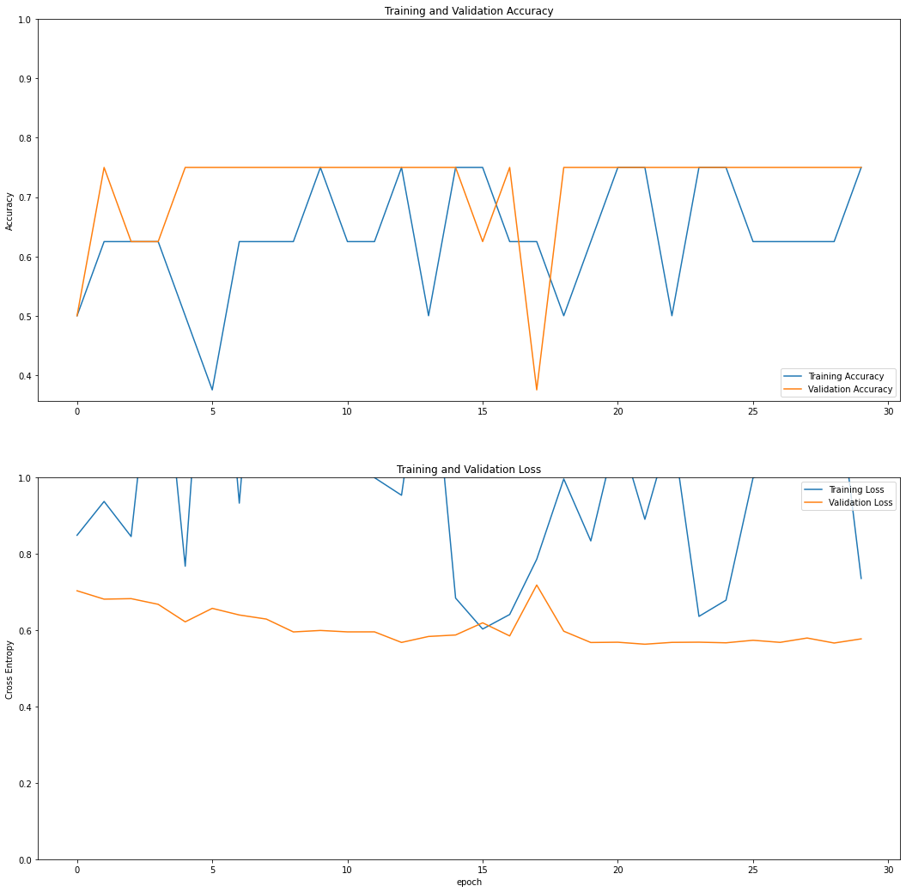

# Projeto Final - Modelos Preditivos Conexionistas

### Victor Queiroga Crescêncio da Costa

|**Tipo de Projeto**|**Modelo Selecionado**|**Linguagem**|
|--|--|--|
|Classificação de Imagens|Modelo construído utilizando o keras|Tensorflow|

## Performance

O modelo treinado possui performance de **75%**.

### Output do bloco de treinamento

<details>
  <summary>Click to expand!</summary>
  
  ```
Found 102 images belonging to 4 classes.
Found 29 images belonging to 4 classes.
Epoch 1/30
/usr/local/lib/python3.7/dist-packages/ipykernel_launcher.py:54: UserWarning: `Model.fit_generator` is deprecated and will be removed in a future version. Please use `Model.fit`, which supports generators.
1/2 [==============>...............] - ETA: 1s - loss: 0.6752 - accuracy: 0.5000
Epoch 1: saving model to training_1/cp.ckpt
2/2 [==============================] - 1s 392ms/step - loss: 0.8484 - accuracy: 0.5000 - val_loss: 0.7030 - val_accuracy: 0.5000
Epoch 2/30
2/2 [==============================] - ETA: 0s - loss: 0.9370 - accuracy: 0.6250
Epoch 2: saving model to training_1/cp.ckpt
2/2 [==============================] - 0s 179ms/step - loss: 0.9370 - accuracy: 0.6250 - val_loss: 0.6810 - val_accuracy: 0.7500
Epoch 3/30
1/2 [==============>...............] - ETA: 0s - loss: 0.9947 - accuracy: 0.7500
Epoch 3: saving model to training_1/cp.ckpt
2/2 [==============================] - 0s 151ms/step - loss: 0.8451 - accuracy: 0.6250 - val_loss: 0.6824 - val_accuracy: 0.6250
Epoch 4/30
1/2 [==============>...............] - ETA: 0s - loss: 1.6649 - accuracy: 0.5000
Epoch 4: saving model to training_1/cp.ckpt
2/2 [==============================] - 0s 151ms/step - loss: 1.4841 - accuracy: 0.6250 - val_loss: 0.6675 - val_accuracy: 0.6250
Epoch 5/30
1/2 [==============>...............] - ETA: 0s - loss: 0.7016 - accuracy: 0.5000
Epoch 5: saving model to training_1/cp.ckpt
2/2 [==============================] - 0s 153ms/step - loss: 0.7673 - accuracy: 0.5000 - val_loss: 0.6216 - val_accuracy: 0.7500
Epoch 6/30
1/2 [==============>...............] - ETA: 0s - loss: 1.6422 - accuracy: 0.5000
Epoch 6: saving model to training_1/cp.ckpt
2/2 [==============================] - 0s 169ms/step - loss: 1.7664 - accuracy: 0.3750 - val_loss: 0.6570 - val_accuracy: 0.7500
Epoch 7/30
1/2 [==============>...............] - ETA: 0s - loss: 0.8651 - accuracy: 0.5000
Epoch 7: saving model to training_1/cp.ckpt
2/2 [==============================] - 0s 173ms/step - loss: 0.9325 - accuracy: 0.6250 - val_loss: 0.6396 - val_accuracy: 0.7500
Epoch 8/30
1/2 [==============>...............] - ETA: 0s - loss: 0.6581 - accuracy: 0.7500
Epoch 8: saving model to training_1/cp.ckpt
2/2 [==============================] - 0s 157ms/step - loss: 1.7875 - accuracy: 0.6250 - val_loss: 0.6289 - val_accuracy: 0.7500
Epoch 9/30
2/2 [==============================] - ETA: 0s - loss: 1.1541 - accuracy: 0.6250
Epoch 9: saving model to training_1/cp.ckpt
2/2 [==============================] - 0s 174ms/step - loss: 1.1541 - accuracy: 0.6250 - val_loss: 0.5952 - val_accuracy: 0.7500
Epoch 10/30
1/2 [==============>...............] - ETA: 0s - loss: 1.8952 - accuracy: 0.7500
Epoch 10: saving model to training_1/cp.ckpt
2/2 [==============================] - 0s 185ms/step - loss: 2.1261 - accuracy: 0.7500 - val_loss: 0.5991 - val_accuracy: 0.7500
Epoch 11/30
1/2 [==============>...............] - ETA: 0s - loss: 1.0130 - accuracy: 0.7500
Epoch 11: saving model to training_1/cp.ckpt
2/2 [==============================] - 0s 166ms/step - loss: 1.1528 - accuracy: 0.6250 - val_loss: 0.5954 - val_accuracy: 0.7500
Epoch 12/30
1/2 [==============>...............] - ETA: 0s - loss: 1.0890 - accuracy: 0.5000
Epoch 12: saving model to training_1/cp.ckpt
2/2 [==============================] - 0s 177ms/step - loss: 0.9993 - accuracy: 0.6250 - val_loss: 0.5954 - val_accuracy: 0.7500
Epoch 13/30
1/2 [==============>...............] - ETA: 0s - loss: 0.9762 - accuracy: 0.7500
Epoch 13: saving model to training_1/cp.ckpt
2/2 [==============================] - 0s 158ms/step - loss: 0.9531 - accuracy: 0.7500 - val_loss: 0.5677 - val_accuracy: 0.7500
Epoch 14/30
1/2 [==============>...............] - ETA: 0s - loss: 0.6611 - accuracy: 0.5000
Epoch 14: saving model to training_1/cp.ckpt
2/2 [==============================] - 0s 164ms/step - loss: 1.4481 - accuracy: 0.5000 - val_loss: 0.5833 - val_accuracy: 0.7500
Epoch 15/30
1/2 [==============>...............] - ETA: 0s - loss: 0.7285 - accuracy: 0.7500
Epoch 15: saving model to training_1/cp.ckpt
2/2 [==============================] - 0s 163ms/step - loss: 0.6838 - accuracy: 0.7500 - val_loss: 0.5872 - val_accuracy: 0.7500
Epoch 16/30
1/2 [==============>...............] - ETA: 0s - loss: 0.6266 - accuracy: 0.7500
Epoch 16: saving model to training_1/cp.ckpt
2/2 [==============================] - 0s 161ms/step - loss: 0.6028 - accuracy: 0.7500 - val_loss: 0.6191 - val_accuracy: 0.6250
Epoch 17/30
1/2 [==============>...............] - ETA: 0s - loss: 0.6503 - accuracy: 0.7500
Epoch 17: saving model to training_1/cp.ckpt
2/2 [==============================] - 0s 159ms/step - loss: 0.6409 - accuracy: 0.6250 - val_loss: 0.5848 - val_accuracy: 0.7500
Epoch 18/30
1/2 [==============>...............] - ETA: 0s - loss: 0.9548 - accuracy: 0.5000
Epoch 18: saving model to training_1/cp.ckpt
2/2 [==============================] - 0s 153ms/step - loss: 0.7855 - accuracy: 0.6250 - val_loss: 0.7181 - val_accuracy: 0.3750
Epoch 19/30
1/2 [==============>...............] - ETA: 0s - loss: 1.0382 - accuracy: 0.5000
Epoch 19: saving model to training_1/cp.ckpt
2/2 [==============================] - 0s 205ms/step - loss: 0.9958 - accuracy: 0.5000 - val_loss: 0.5971 - val_accuracy: 0.7500
Epoch 20/30
1/2 [==============>...............] - ETA: 0s - loss: 1.0629 - accuracy: 0.5000
Epoch 20: saving model to training_1/cp.ckpt
2/2 [==============================] - 0s 150ms/step - loss: 0.8336 - accuracy: 0.6250 - val_loss: 0.5675 - val_accuracy: 0.7500
Epoch 21/30
1/2 [==============>...............] - ETA: 0s - loss: 0.6543 - accuracy: 0.7500
Epoch 21: saving model to training_1/cp.ckpt
2/2 [==============================] - 0s 394ms/step - loss: 1.1296 - accuracy: 0.7500 - val_loss: 0.5683 - val_accuracy: 0.7500
Epoch 22/30
2/2 [==============================] - ETA: 0s - loss: 0.8902 - accuracy: 0.7500
Epoch 22: saving model to training_1/cp.ckpt
2/2 [==============================] - 0s 290ms/step - loss: 0.8902 - accuracy: 0.7500 - val_loss: 0.5631 - val_accuracy: 0.7500
Epoch 23/30
1/2 [==============>...............] - ETA: 0s - loss: 1.0012 - accuracy: 0.5000
Epoch 23: saving model to training_1/cp.ckpt
2/2 [==============================] - 0s 165ms/step - loss: 1.1379 - accuracy: 0.5000 - val_loss: 0.5679 - val_accuracy: 0.7500
Epoch 24/30
1/2 [==============>...............] - ETA: 0s - loss: 0.6916 - accuracy: 0.7500
Epoch 24: saving model to training_1/cp.ckpt
2/2 [==============================] - 0s 189ms/step - loss: 0.6359 - accuracy: 0.7500 - val_loss: 0.5684 - val_accuracy: 0.7500
Epoch 25/30
1/2 [==============>...............] - ETA: 0s - loss: 0.7150 - accuracy: 0.7500
Epoch 25: saving model to training_1/cp.ckpt
2/2 [==============================] - 0s 190ms/step - loss: 0.6784 - accuracy: 0.7500 - val_loss: 0.5667 - val_accuracy: 0.7500
Epoch 26/30
1/2 [==============>...............] - ETA: 0s - loss: 0.7314 - accuracy: 0.5000
Epoch 26: saving model to training_1/cp.ckpt
2/2 [==============================] - 0s 154ms/step - loss: 0.9987 - accuracy: 0.6250 - val_loss: 0.5734 - val_accuracy: 0.7500
Epoch 27/30
1/2 [==============>...............] - ETA: 0s - loss: 0.9599 - accuracy: 0.5000
Epoch 27: saving model to training_1/cp.ckpt
2/2 [==============================] - 0s 216ms/step - loss: 1.0302 - accuracy: 0.6250 - val_loss: 0.5679 - val_accuracy: 0.7500
Epoch 28/30
2/2 [==============================] - ETA: 0s - loss: 1.1434 - accuracy: 0.6250
Epoch 28: saving model to training_1/cp.ckpt
2/2 [==============================] - 0s 248ms/step - loss: 1.1434 - accuracy: 0.6250 - val_loss: 0.5793 - val_accuracy: 0.7500
Epoch 29/30
2/2 [==============================] - ETA: 0s - loss: 1.3152 - accuracy: 0.6250
Epoch 29: saving model to training_1/cp.ckpt
2/2 [==============================] - 0s 228ms/step - loss: 1.3152 - accuracy: 0.6250 - val_loss: 0.5662 - val_accuracy: 0.7500
Epoch 30/30
2/2 [==============================] - ETA: 0s - loss: 0.7353 - accuracy: 0.7500
Epoch 30: saving model to training_1/cp.ckpt
2/2 [==============================] - 0s 228ms/step - loss: 0.7353 - accuracy: 0.7500 - val_loss: 0.5771 - val_accuracy: 0.7500
  ```
</details>

### Evidências do treinamento




## Roboflow

[https://universe.roboflow.com/classification/cats--dogs-and-birds]

## HuggingFace

https://huggingface.co/vqcc/dogs_cats_birds
